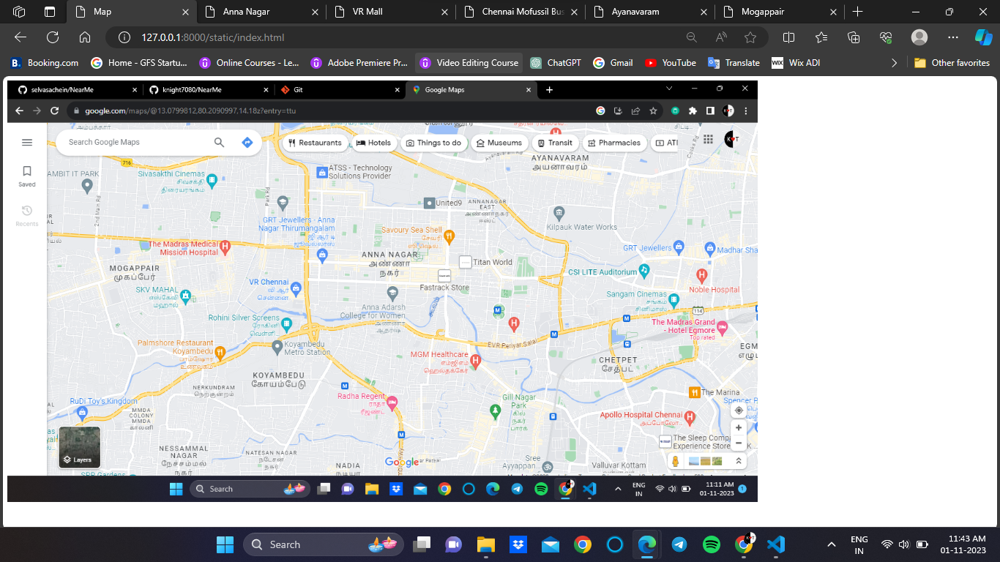

# Ex04 Places Around Me

Date : 17-10-2023

## AIM
To develop a website to display details about the places around my house.

## DESIGN STEPS

### STEP 1
Create a Django admin interface.

### STEP 2
Download your city map from Google.

### STEP 3
Using ```<map>``` tag name the map.

### STEP 4
Create clickable regions in the image using ```<area>``` tag.

### STEP 5
Write HTML programs for all the regions identified.

### STEP 6
Execute the programs and publish them.

## CODE

```html
<!DOCTYPE html>
<html lang="en">
<head>
    <meta charset="UTF-8">
    <meta name="viewport" content="width=device-width, initial-scale=1.0">
    <title>Map</title>
</head>
<body>
    

    <map name="image-map">
        <area target="_blank" alt="VR Mall" title="VR Mall" href="vr.html" coords="453,362,538,398" shape="rect">
        <area target="_blank" alt="koyambedu" title="koyambedu" href="cmbt.html" coords="445,529,546,565" shape="rect">
        <area target="_blank" alt="annanagar" title="annanagar" href="annanagar.html" coords="758,363,643,310" shape="rect">
        <area target="_blank" alt="mogappair" title="mogappair" href="mogappair.html" coords="178,331,287,371" shape="rect">
        <area target="_blank" alt="ayanavaram" title="ayanavaram" href="ayanavaram.html" coords="950,135,1069,165" shape="rect">
    </map>
</body>
</html>
```

```html
<!DOCTYPE html>
<html lang="en">
<head>
    <meta charset="UTF-8">
    <meta name="viewport" content="width=device-width, initial-scale=1.0">
    <title>Chennai Mofussil Bus Terminus</title>
    <style>
        h1{
            text-align: center;
            font-family: 'Lucida Sans', 'Lucida Sans Regular', 'Lucida Grande', 'Lucida Sans Unicode', Geneva, Verdana, sans-serif;
            color:darkslategray;
        }
        p{
            text-align: justify;
            color:darkolivegreen;
            font-size: x-large;
            
        }
    </style>
</head>
<body>
    <h1>Chennai Mofussil Bus Terminus</h1>
    <br>
    <hr color="Brown">
    <p>Chennai Mofussil Bus Terminus, officially Puratchi Thalaivar Dr. M.G.R. Bus Terminus, is a bus terminus located in Chennai, India, providing inter-state bus transport services. It is located on the 100 feet (30 m) Jawaharlal Nehru Salai in Koyambedu between SAF Games Village and the Koyambedu Vegetable Market. It is the second largest bus terminus in India as well as Asia.[1][2] Chennai Metro Rail has operated a coach depot behind the bus terminus since 2015.</p>
</body>
</html>
```

```html
<!DOCTYPE html>
<html lang="en">
<head>
    <meta charset="UTF-8">
    <meta name="viewport" content="width=device-width, initial-scale=1.0">
    <title>VR Mall</title>
    <style>
        h1{
            text-align: center;
            font-family: 'Lucida Sans', 'Lucida Sans Regular', 'Lucida Grande', 'Lucida Sans Unicode', Geneva, Verdana, sans-serif;
            color:darkslategray;
        }
        p{
            text-align: justify;
            color:darkolivegreen;
            font-size: x-large;
            
        }
    </style>
</head>
<body>
    <h1>VR Mall</h1>
    <br>
    <hr color="Brown">
    <p>VR Chennai (Tamil: வி. ஆர். சென்னை) is a shopping mall located on Jawaharlal Nehru Road in Anna Nagar West, Chennai, Tamil Nadu, India.[3] This mall was opened to the public on 18 June 2018.[1] It is one of the largest malls in Chennai by area, occupying 1,840,000 square feet (171,000 m2) built-up area with 1,000,000 square feet (93,000 m2) of retail space.</p>

</body>
</html>
```

```html
<!DOCTYPE html>
<html lang="en">
<head>
    <meta charset="UTF-8">
    <meta name="viewport" content="width=device-width, initial-scale=1.0">
    <title>Anna Nagar</title>
    <style>
        h1{
            text-align: center;
            font-family: 'Lucida Sans', 'Lucida Sans Regular', 'Lucida Grande', 'Lucida Sans Unicode', Geneva, Verdana, sans-serif;
            color:darkslategray;
        }
        p{
            text-align: justify;
            color:darkolivegreen;
            font-size: x-large;
            
        }
    </style>
</head>
<body>
    <h1>Anna Nagar</h1>
    <br>
    <hr color="Brown">
    <p>Anna Nagar (formerly known as Naduvakkarai),[1] is a neighbourhood in the metropolitan city of Chennai, India. Named after former chief minister of Tamil Nadu C. N. Annadurai, it is located in the north-western part of Chennai and forms a part of the Aminjikarai taluk and the Anna Nagar Zone. It is one of the prime residential areas in Chennai and is home to several prominent doctors, lawyers and politicians. Real estate prices are among the highest in the city.[2] A recent addition to the area is VR Chennai Mall, located near Shanthi Colony and Thirumangalam junction.</p>
</body>
</html>
```

```html
<!DOCTYPE html>
<html lang="en">
<head>
    <meta charset="UTF-8">
    <meta name="viewport" content="width=device-width, initial-scale=1.0">
    <title>Mogappair</title>
    <style>
        h1{
            text-align: center;
            font-family: 'Lucida Sans', 'Lucida Sans Regular', 'Lucida Grande', 'Lucida Sans Unicode', Geneva, Verdana, sans-serif;
            color:darkslategray;
        }
        p{
            text-align: justify;
            color:darkolivegreen;
            font-size: x-large;
            
        }
    </style>
</head>
<body>
    <h1>Mogappair</h1>
    <br>
    <hr color="Brown">
    <p>Mogappair (also known as Dr. J. J. Nagar) is a residential neighborhood in north-western Chennai, India. It is located west of the Jawaharlal Nehru Road (Inner Ring Road) and is part of the Ambattur zone (7) of the Greater Chennai Corporation. There are industrial estates to the north and west, namely, Padi and Ambattur.</p>
</body>
</html>
```

```html
<!DOCTYPE html>
<html lang="en">
<head>
    <meta charset="UTF-8">
    <meta name="viewport" content="width=device-width, initial-scale=1.0">
    <title>Ayanavaram</title>
    <style>
        h1{
            text-align: center;
            font-family: 'Lucida Sans', 'Lucida Sans Regular', 'Lucida Grande', 'Lucida Sans Unicode', Geneva, Verdana, sans-serif;
            color:darkslategray;
        }
        p{
            text-align: justify;
            color:darkolivegreen;
            font-size: x-large;
            
        }
    </style>
</head>
<body>
    <h1>Ayanavaram</h1>
    <br>
    <hr color="Brown">
    <p>The neighbourhood was originally known as Ayanpuram, with Ayan meaning Brahma. When Lord Muruga admonished Brahma and took over creation, it is believed that Brahma prayed to Shiva here and got his action of creativity back. It is believed that Brahma worshipped Shiva at Parasurama Easwaran Koil. It is in recognition of that Ayanpuram is named. (It was also called Brahmapuri)</p>
</body>
</html>
```

## OUTPUT



## RESULT
The program for implementing image maps using HTML is executed successfully.
